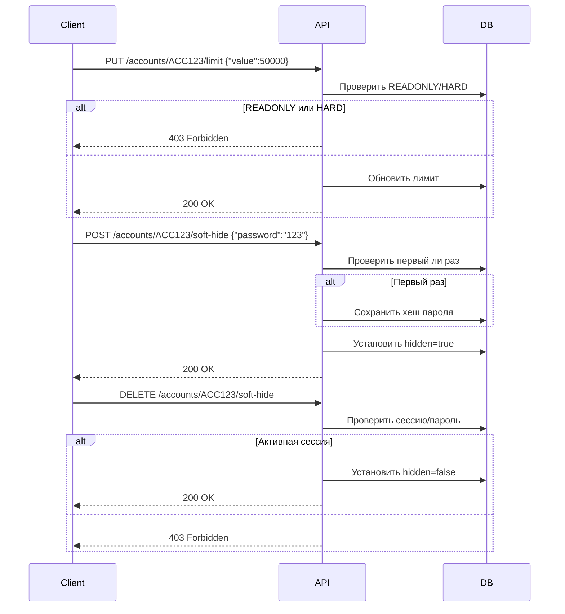
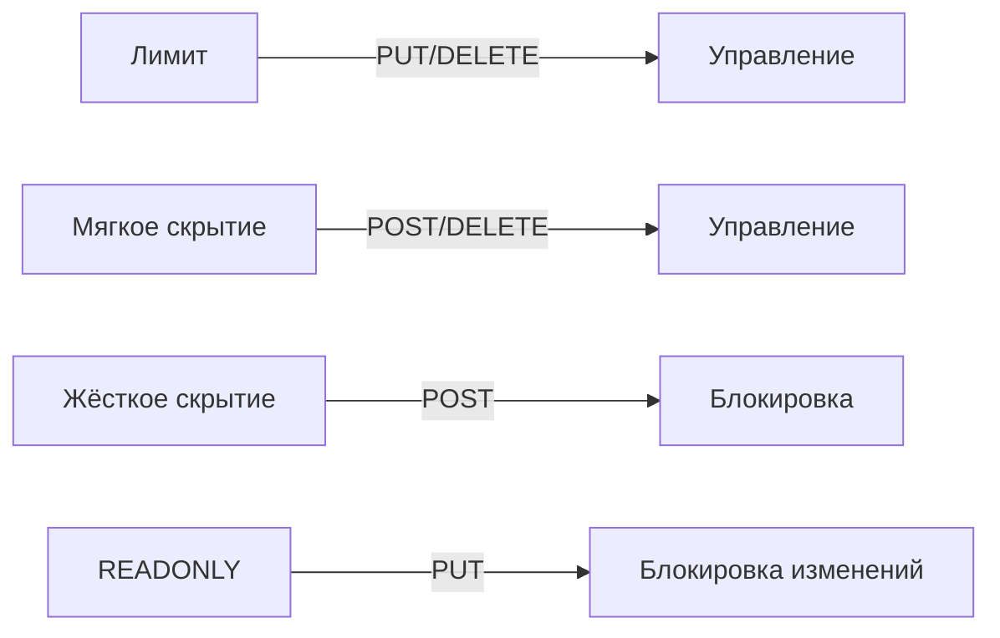

## Документация для бэкенд-разработчика: Управление безопасностью счетов

### Базовый путь  
`/rest/stateful/personal/v1/acc_invisible`

---

### 1. Управление лимитом расходов
**Endpoint:** `PUT /accounts/{accId}/limit`  
**Метод:** `PUT`

#### Описание
Устанавливает или обновляет месячный лимит расходных операций по счёту. Лимит действует как переключатель (toggle) - отправка запроса включает лимит, повторная отправка с `value=0` выключает.

#### Параметры пути
- `accId`: Идентификатор счёта

#### Тело запроса
```json
{
  "value": "number (≥0)",
}
```

#### Ответ
```json
{
  "accId": "string",
  "limitEnabled": "boolean"
}
```

#### Ошибки
- `400 Bad Request`: Неверное значение лимита
- `403 Forbidden`: Счёт в HARD-режиме или READONLY
- `404 Not Found`: Счёт не найден

---

### 2. Управление мягким скрытием
**Endpoint:** `POST /accounts/{accId}/soft-hide`  
**Метод:** `POST`

#### Описание
Активирует мягкое скрытие счёта. Требует пароль при первом использовании для установки мастер-пароля.

#### Параметры пути
- `accId`: Идентификатор счёта

#### Тело запроса
```json
{
  "password": "string (обязательно при первом скрытии)"
}
```

#### Ответ
```json
{
  "accId": "string",
  "hidden": true
}
```

---

### 3. Снятие мягкого скрытия
**Endpoint:** `DELETE /accounts/{accId}/soft-hide`  
**Метод:** `DELETE`

#### Описание
Отключает мягкое скрытие счёта. Требует активной сессии раскрытия или пароля.

#### Параметры пути
- `accId`: Идентификатор счёта

#### Тело запроса (опционально)
```json
{
  "password": "string"
}
```

#### Ответ
```json
{
  "accId": "string",
  "hidden": false
}
```

---

### 4. Управление жёстким скрытием
**Endpoint:** `POST /accounts/{accId}/hard-hide`  
**Метод:** `POST`

#### Описание
Активирует окончательное скрытие счёта. Необратимая операция.

#### Параметры пути
- `accId`: Идентификатор счёта

#### Ответ
```json
{
  "accId": "string",
  "hidden": true
}
```

---

### 5. Управление режимом "Запретить изменение параметров через Metib-online"
**Endpoint:** `PUT /accounts/{accId}/readonly`  
**Метод:** `PUT`

#### Описание
Активирует или деактивирует режим только для чтения. Отключение доступно только в офисе банка.

#### Параметры пути
- `accId`: Идентификатор счёта

#### Тело запроса
```json
{
  "enabled": "boolean"
}
```

#### Ответ
```json
{
  "accId": "string",
  "readonly": "boolean"
}
```

---

### 6. Создание сессии раскрытия
**Endpoint:** `POST /reveal-sessions`  
**Метод:** `POST`

#### Описание
Создаёт 5-минутную сессию для доступа к скрытым счетам.

#### Тело запроса
```json
{
  "password": "string"
}
```

#### Ответ
```json
{
  "sessionToken": "string",
  "expiresIn": 300,
  "expiresAt": "ISO 8601"
}
```

---

### 7. Управление мастер-паролем
**Endpoint:** `PUT /master-password`  
**Метод:** `PUT`

#### Описание
Изменяет мастер-пароль для доступа к скрытым счетам.

#### Тело запроса
```json
{
  "currentPassword": "string",
  "newPassword": "string"
}
```

#### Ответ
```json
{
  "changedAt": "ISO 8601"
}
```

---

### Диаграмма взаимодействия


---

### Бизнес-правила

#### 1. Управление лимитом
- Лимит включается при PUT с value > 0
- Лимит выключается при PUT с value = 0
- Месячный лимит автоматически сбрасывается
- Отображается min(лимит, реальный_баланс)

#### 2. Мягкое скрытие
- Активация:
  - Обязательный пароль при первом скрытии
  - Пароль опционален при повторной активации
- Деактивация:
  - Требуется активная сессия раскрытия
  - Опциональный пароль (альтернатива сессии)
  - Автоматически снимается при деактивации

#### 3. Жёсткое скрытие
- Окончательная операция
- Нет возможности отмены
- Счёт полностью скрывается из системы

#### 4. Режим READONLY
- Активация блокирует:
  - Изменение лимита
  - Управление скрытием
  - Снятие самого READONLY
- Деактивация доступна только в офисе

#### 5. Сессии раскрытия
- Действуют 5 минут
- Требуют валидный мастер-пароль
- Позволяют управлять SOFT-счетами
- Одна активная сессия на пользователя

---

### Примеры запросов

#### Включение лимита
```http
PUT /rest/stateful/personal/v1/acc_invisible/accounts/ACC123/limit
Content-Type: application/json

{
  "value": 100000
}
```

#### Активация мягкого скрытия (первый раз)
```http
POST /rest/stateful/personal/v1/acc_invisible/accounts/ACC123/soft-hide
Content-Type: application/json

{
  "password": "secure123"
}
```

#### Деактивация мягкого скрытия (через сессию)
```http
DELETE /rest/stateful/personal/v1/acc_invisible/accounts/ACC123/soft-hide
Authorization: Bearer <session_token>
```

#### Деактивация мягкого скрытия (через пароль)
```http
DELETE /rest/stateful/personal/v1/acc_invisible/accounts/ACC123/soft-hide
Content-Type: application/json

{
  "password": "secure123"
}
```

#### Активация жёсткого скрытия
```http
POST /rest/stateful/personal/v1/acc_invisible/accounts/ACC123/hard-hide
```

#### Активация режима READONLY
```http
PUT /rest/stateful/personal/v1/acc_invisible/accounts/ACC123/readonly
Content-Type: application/json

{
  "enabled": true
}
```

#### Создание сессии
```http
POST /rest/stateful/personal/v1/acc_invisible/reveal-sessions
Content-Type: application/json

{
  "password": "secure123"
}
```

---

### Особенности реализации

1. **Независимые состояния**:


2. **Приоритеты состояний**:
   - HARD > READONLY > SOFT > LIMIT
   - HARD блокирует все операции
   - READONLY блокирует изменения параметров безопасности

3. **Опциональный пароль**:
   - Всегда обязателен при первом SOFT-скрытии
   - Опционален при деактивации SOFT-скрытия
   - Альтернатива сессии для управления скрытыми счетами

4. **Автоматика лимитов**:
   - Ежедневная задача сброса в начале месяца
   - Отслеживание использования в реальном времени
   - Автоматическое отключение при достижении лимита

5. **Безопасность операций**:
   - Все запросы требуют основной аутентификации
   - Дополнительная проверка сессии/пароля для скрытых счетов
   - Хеширование паролей с использованием bcrypt
